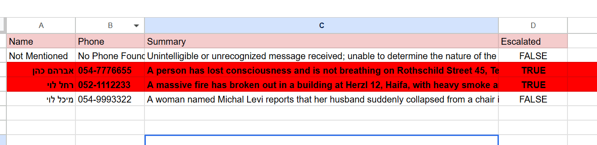
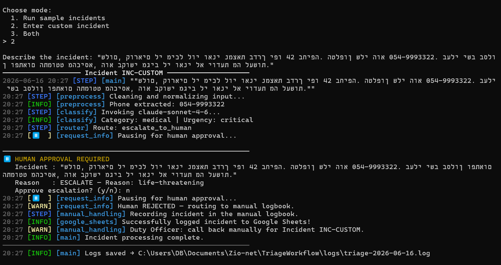
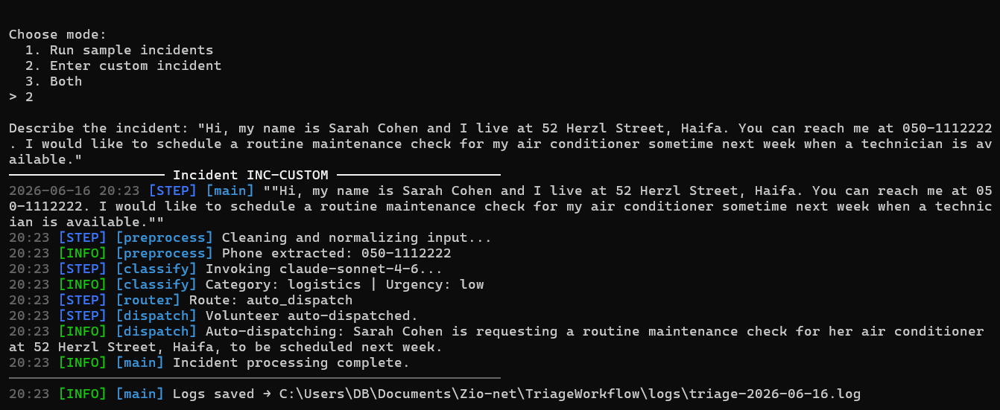
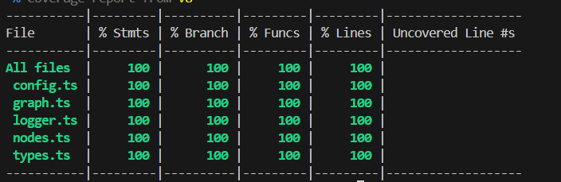

# TriageWorkflow — Crisis Triage System

An AI-powered triage workflow for emergency volunteer command centers, built with **LangGraph** and **Claude**.  
The system receives incident reports, classifies them in real time, routes them to the right handler, and logs everything automatically to Google Sheets.

---

## Tech Stack

| Technology | Why |
|---|---|
| LangGraph | Supports branching logic and human-in-the-loop interrupt |
| Claude (Anthropic) | Structured output via SDK — no JSON parsing |
| Zod | Runtime schema validation + TypeScript types for free |
| Google Sheets API | External audit log without a database |
| Vitest | Fast, native TypeScript support |
| TypeScript | Type safety across the entire codebase |

---

## How It Works

Every incident goes through a multi-step graph:

```
Input → preprocess → classify (Claude AI) → router
                                              ├─ auto_dispatch  ──────────────────────→ END
                                              └─ request_info (human interrupt)
                                                   ├─ escalate  → Google Sheets → END
                                                   └─ manual    → Google Sheets → END
```

1. **Preprocess** — Cleans and normalizes the raw text, collapses extra whitespace and punctuation, and extracts Israeli phone numbers automatically.
2. **Classify** — Sends the text to Claude, which returns structured output: incident category, urgency level, severity level, model confidence score, reasoning rationale, any missing information, a short summary, and the caller's name if mentioned.
3. **Route** — Decides what happens next based on the classification using dynamic escalation rules. It automatically routes the incident to a human commander if any of the following risk conditions are met:
   - Urgency is critical or severity is catastrophic
   - Model confidence score is low, less than 0.6, indicating vague or unverified text
   - Critical information, address or phone, is missing from the report
   - Otherwise, if everything looks solid, it triggers an auto-dispatch for immediate deployment.

4. **Human approval** — When escalation is triggered, the graph pauses using LangGraph's `interrupt()` and prompts the duty officer via the CLI. If approved, the incident is logged to Google Sheets as escalated. If rejected, it goes to the manual handling log instead.

---

## AI Classification

Claude returns a structured Zod-validated response for every incident:

- **category** — `logistics` / `medical` / `rescue` / `unknown`
- **urgency** — `low` / `medium` / `critical`
- **severity** — `low` / `medium` / `high` / `catastrophic` (measures the overall damage and systemic impact)
- **confidence** — a float from `0.0` to `1.0` representing model classification certainty
- **rationale** — a short, single-sentence technical explanation of why these classification labels were chosen
- **missing_info** — which fields are absent: strictly limited to `address`, `phone`, or empty if complete
- **summary** — a one-sentence English summary of the incident
- **user_name** — the caller's name if explicitly mentioned, otherwise `null`

---

## Google Sheets Integration

Every incident that reaches a resolution is automatically logged to Google Sheets with the columns:  
**Name | Phone | Summary | Escalated**

Requires a `credentials.json` service account file with access to the Google Sheets API.

---

## Logging

Every run produces color-coded structured logs in the terminal, organized by level:  
`STEP` · `INFO` · `WARN` · `ERR` · `STRM` · `⏸ INTERRUPT`

Logs are also saved to a daily file at `logs/triage-YYYY-MM-DD.log`, with ANSI codes stripped.

---

## Screenshots

**Google Sheets — automatic incident logging:**  


**Terminal — escalation to human commander (rejected → manual logbook):**  


**Terminal — auto-dispatch flow:**  


---

## Test Coverage — 100%

The project is fully tested with **Vitest**, covering all nodes, routing logic, Zod schemas, and the logger:



---

## Setup

```bash
npm install
cp .env.example .env
```

Add your credentials to `.env`:
```
ANTHROPIC_API_KEY=your_key_here
MODEL_NAME=claude-sonnet-4-6   # optional, this is the default
```

Place your Google service account file as `credentials.json` in the project root.

---

## Run

```bash
npm run dev
```

Choose from the interactive menu:
1. Run built-in sample incidents
2. Enter a custom incident
3. Both

---

## Running with Docker

```bash
docker build -t triage-workflow .
docker run -it --env-file .env -v $(pwd)/credentials.json:/app/credentials.json triage-workflow
```

Requires a `.env` file and a `credentials.json` service account file in the project root.

---

## Testing & Evaluation

```bash
npm test                   # Run mocked unit tests
npm test -- --coverage     # Run tests and generate code coverage report
npm test eval              # Run live E2E evaluation tests against real Claude API
```
